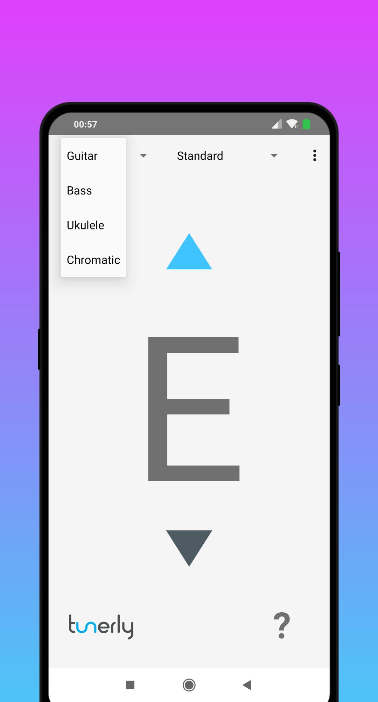

# Tunerly

Tunerly is suited for tuning your Guitar, Bass or Ukulele to various different tunings. It also includes a chromatic tuner. 
Currently supported languages are: English, German and Russian.

## Screenshots

     

## Supported Instrument Tunings

  * Guitar:
  
    * Standard
    
    * 7 String
    
    * 8 String
    
    * E-Flat
    
    * Drop D
    
    * Drop Db
    
    * Double Drop D
    
    * DADGAD
    
    * Open D
    
    * Open A
    
    * Open E
    
    * Open G
    
  * Bass
  
    * 4 String
    
    * 5 String
    
    * 6 String
    
    * Drop D
    
    * D Standard
    
    * Drop C
    
  * Ukulele
  
    * C (Standard)
    
    * D (Traditional)
    
    * Baritone
    
    * Bass
    
## Dependencies

  * [TarsosDSP](https://github.com/JorenSix/TarsosDSP) - A Real-Time Audio Processing Framework in Java

  * [Localization](https://github.com/akexorcist/Localization) - [Android] In-app language changing library
