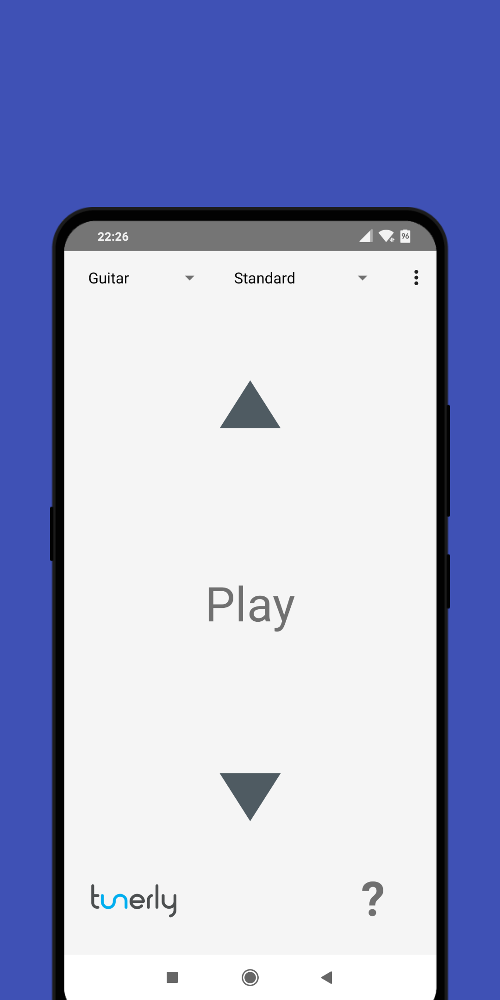
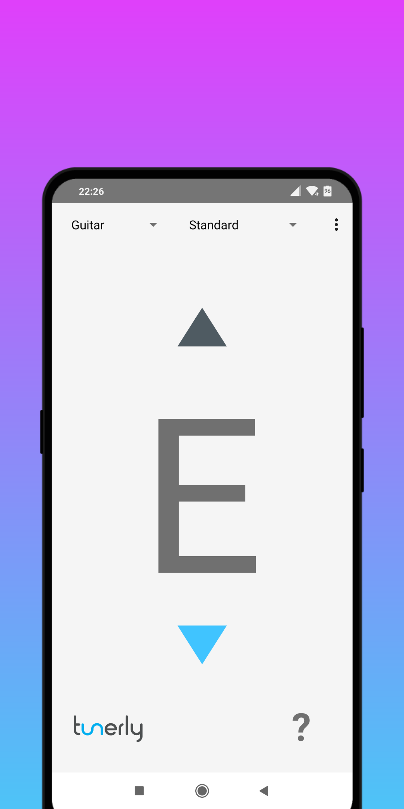
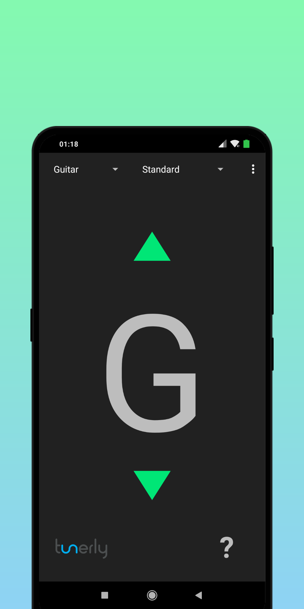
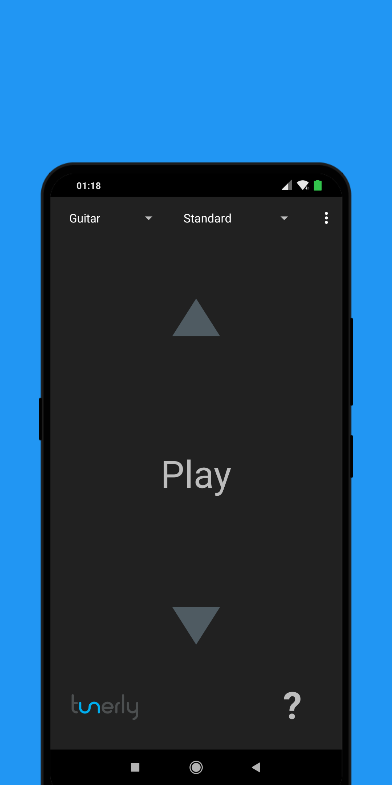
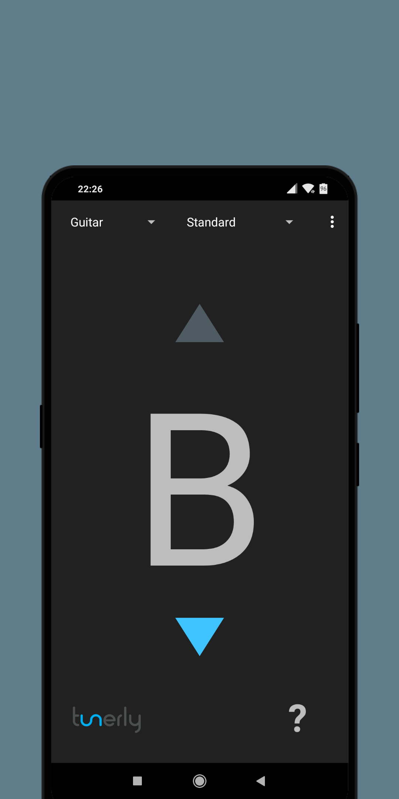

# Tunerly

Tunerly is suited for tuning your Guitar, Bass or Ukulele to various different tunings. It also includes a chromatic tuner. 
Supported languages are currently: English, German and Russian.

## Screenshots

     

## Dependencies

  * [TarsosDSP](https://github.com/JorenSix/TarsosDSP) - A Real-Time Audio Processing Framework in Java

  * [Localization](https://github.com/akexorcist/Localization) - [Android] In-app language changing library
